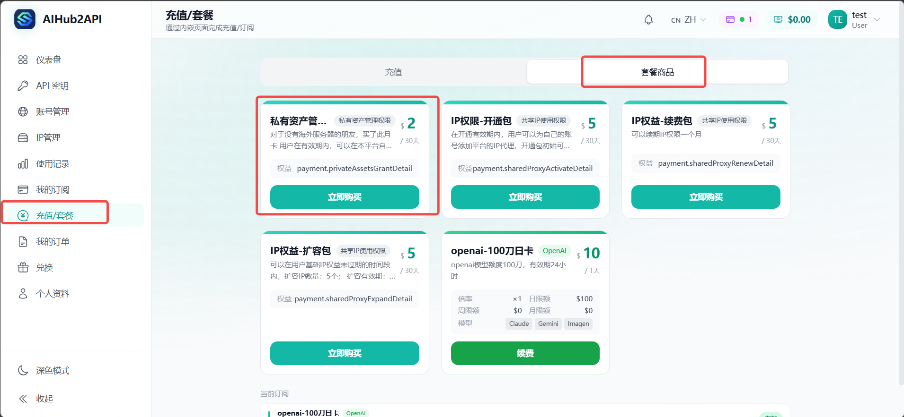
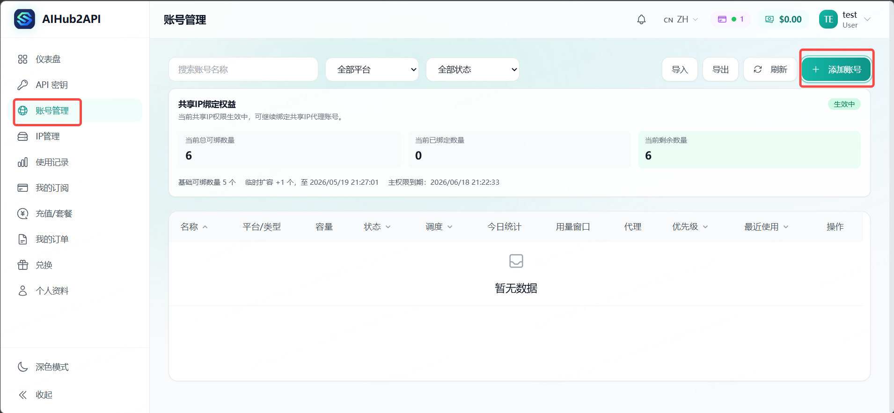
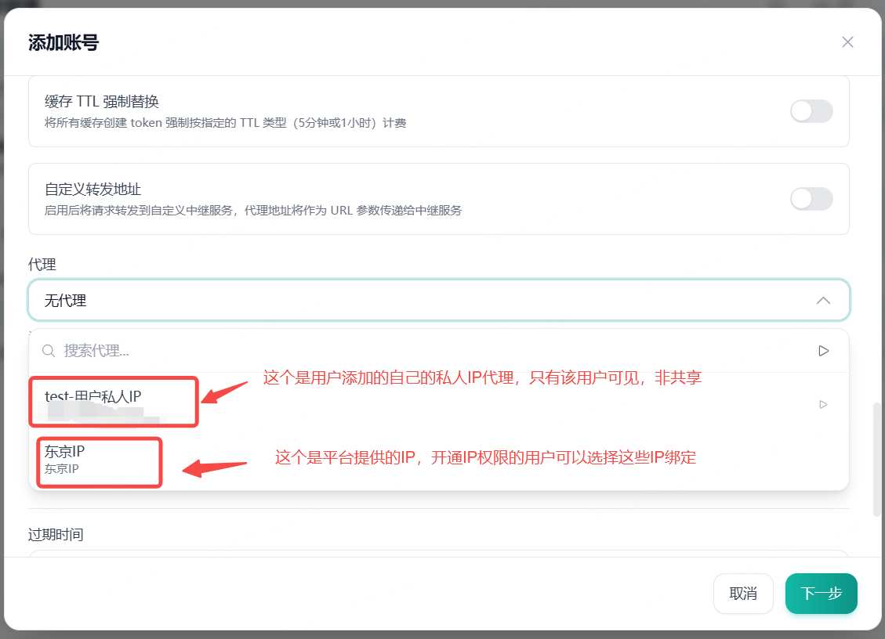
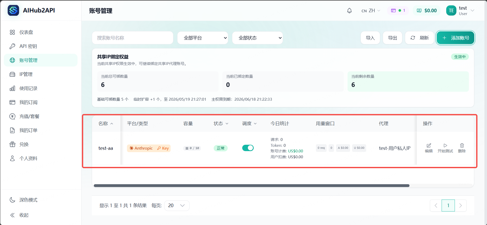
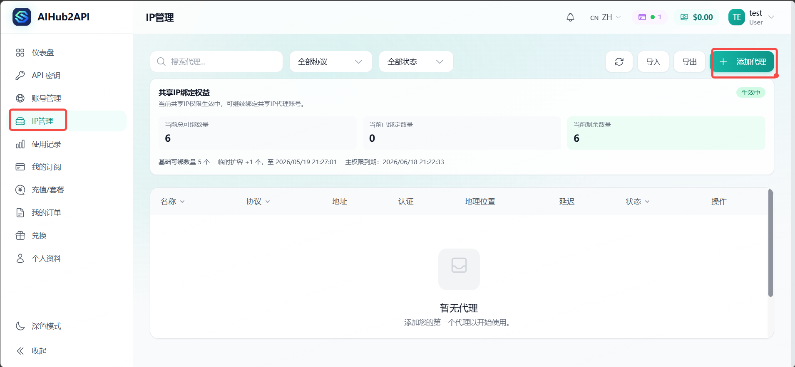
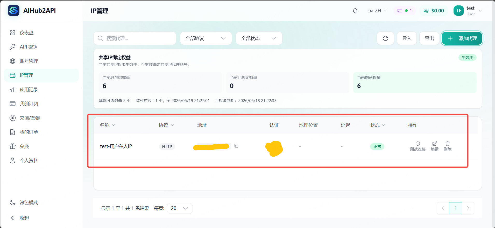
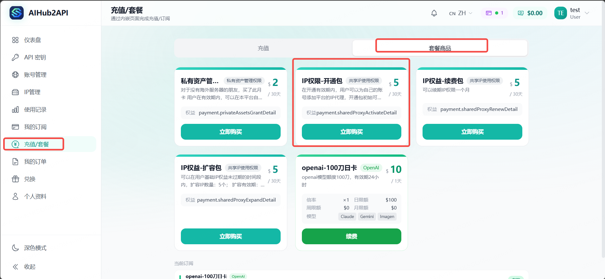
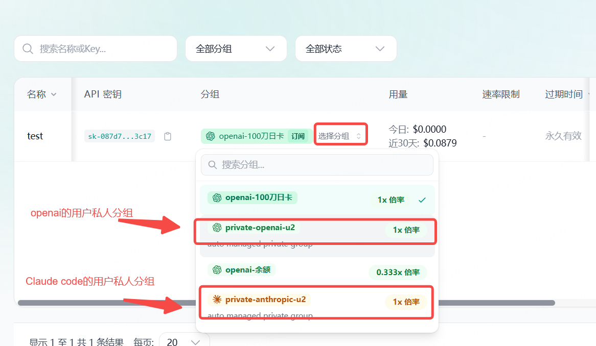
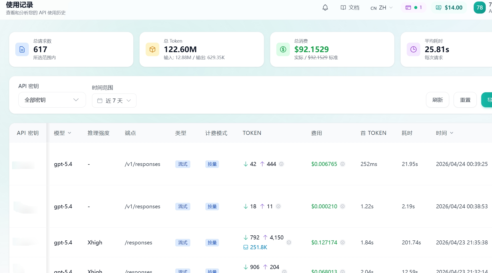

# AIHub2API：AI 账号管理平台 / AI API Gateway，普通人也能直接管理自己的 AI 账号

官网地址：[https://aihub2api.com](https://aihub2api.com)

AIHub2API 是一个面向普通用户和小团队的 **AI 账号管理平台** 与 **AI API Gateway**。它的核心价值是：**用户不需要自己搭中转站，也不需要自己维护复杂的代理和服务器环境，就可以直接把自己的 OpenAI、Claude、Gemini、Codex 等账号导入平台统一管理和调用。**

如果你在搜索这些问题，这个项目就是为这类需求设计的：

- AI 账号管理平台
- AI API Gateway
- OpenAI 中转 / OpenAI proxy
- Claude 中转 / Claude proxy
- Gemini 中转 / Gemini proxy
- Codex 中转 / Codex proxy
- 共享 IP / 共享代理 / shared proxy / shared IP
- 无需自建中转站
- 导入自己的 OpenAI / Claude / Gemini / Codex 账号
- API Key 分发、用量统计、AI 账号统一管理

## AIHub2API 是什么

很多人想把自己的 OpenAI、Gemini、Claude、Codex 一类账号统一管理起来，第一反应往往是“自己搭一个中转站”。但真正做过的人都知道，这件事远没有表面上那么简单。

你要准备服务器，要配 Docker、数据库、Redis、反向代理，要处理线路、代理、风控、更新、掉线、监控，还要持续维护。对普通用户来说，这不仅费时费力，而且门槛很高。很多人并不是不会用 AI，而是被“先搭一整套基础设施”这件事劝退了。

AIHub2API 解决的正是这件事。它不是让用户去学怎么搭中转站，而是直接提供一套已经搭好的中转管理环境。用户不需要自己买服务器、配环境、折腾网络，只需要注册登录后，把自己的账号导入进来，就可以开始统一管理、统一调用、统一查看使用情况。

## 核心功能

- 导入并管理自己的 OpenAI、Claude、Gemini、Codex 等 AI 账号
- 直接使用已经搭好的共享中转、共享 IP、共享代理能力
- 无需自己部署 AI 中转站、API 网关、代理环境
- 统一生成和管理 API Key
- 统一查看账号状态、调用情况、使用量和账单明细
- 支持账号管理、IP 管理、共享中转绑定额度查看
- 支持续费、扩容、自助开通等完整管理闭环

## 适合谁

- 想找 AI 账号管理平台，而不是自己从零搭系统的人
- 想把多个 OpenAI / Claude / Gemini / Codex 账号统一管理的人
- 不想处理服务器、代理、共享 IP、反向代理和运维细节的人
- 想保留“自己的账号自己管理”自主权的个人用户和小团队
- 想要 AI API Gateway、共享代理、统一 API Key 管理能力的用户

## 常见问题

### AIHub2API 是什么？

AIHub2API 是一个 AI 账号管理平台，也是一个 AI API Gateway。它帮助用户在已经搭好的中转环境中导入、绑定、管理和调用自己的 AI 账号。

### 需要自己搭中转站吗？

不需要。AIHub2API 最大的特点就是已经把中转能力提前搭好了，普通用户不必再自己部署中转站、配置服务器和代理环境。

### 支持哪些平台？

当前核心宣传方向包括 OpenAI、Claude、Gemini、Codex 等主流 AI 平台账号管理与统一调用。

### 可以导入自己的账号吗？

可以。AIHub2API 的核心卖点之一就是支持用户把自己的 OpenAI、Claude、Gemini、Codex 等账号导入平台统一管理，而不是只能使用平台公共账号。

### 可以做什么管理？

可以做 AI 账号管理、IP / 代理管理、共享中转绑定、API Key 分发、用量统计、账单查看和权限管理。

## English Search Keywords

AIHub2API is an **AI account management platform** and **AI API gateway** for users who want to import and manage their own OpenAI, Claude, Gemini and Codex accounts without self-hosting a proxy server or API relay system.

## 界面预览

### 平台总览

### 账号管理

### 共享 IP / 代理管理

### 其他页面展示

## 它解决的不是“会不会用”，而是“还要不要自己折腾”

传统做法里，用户如果想把自己的账号接入 API，通常要自己完成这些事：

- 自己部署中转站
- 自己准备可用代理或线路
- 自己处理账号接入和鉴权
- 自己维护后台、数据和更新
- 自己排查报错、掉线和限制问题

而这个网站把其中最麻烦的一段直接省掉了：

- 站长已经把中转能力和管理后台搭好
- 用户可以直接在网站里导入自己的账号
- 用户可以绑定站内已经配置好的共享中转 / 共享 IP
- 不需要自己再单独部署一整套系统
- 依然可以保留“自己的账号自己管理”的自主性

这就是它最适合普通用户的地方。

## 这个网站的核心卖点

### 1. 已经搭好的中转能力，普通用户开箱即用

对大多数人来说，最大的成本不是买账号，而是把账号“稳定接起来”。这个网站已经把底层中转、管理后台和配套能力准备好了，用户不需要再从零自建，只要在现成环境里使用即可。

### 2. 用户可以直接导入自己的账号，而不是只能用平台公用账号

这点很关键。

很多站点只是卖现成额度，用户对底层账号没有管理能力；而这个网站支持用户把自己的账号导入进来管理。你可以把自己的账号资产接进系统，而不是完全依赖别人分配的公共资源。

这意味着：

- 账号是你自己的
- 管理权也在你自己手里
- 可以统一维护多个账号
- 可以随时查看账号状态、使用情况和绑定关系
- 不用担心模型注水，跑的都是自己的账号

### 3. 不用自己搭代理，直接使用站内已经配置好的共享中转 / 共享 IP

这正是最适合宣传的差异点。

很多普通用户卡在“账号有了，但没有合适线路、不会配代理、不会做网络转发”这一步。这个网站提供的是一种更省事的方案：站内已经准备好共享中转能力，用户只需要把自己的账号导入后绑定即可，不必再自己额外搭一层中转站。

简单说就是：

不是“你先学会搭站，再来管理账号”，而是“站已经搭好，你直接管理自己的账号”。

### 4. 不只是导入账号，还能形成完整的管理闭环

这个网站不是一个简单的“账号收集页”，而是一套完整的账号管理系统。用户导入账号后，还可以继续完成：

- 账号管理
- IP / 代理管理
- 共享中转绑定额度查看
- API Key 分发和调用
- 使用量、余额、账单明细查看
- 权限开通、续费、扩容等自助操作
- 可以多人拼几个openai的订阅，然后导入平台管理，简单粗暴

也就是说，用户得到的不是一个零散工具，而是一套能长期使用的后台。

### 5. 更适合不会运维、但又想掌握自己账号的人

自建中转站更适合有服务器经验、有时间维护、需要深度定制的人。

而这个网站更适合另一类用户：

- 不想折腾部署
- 不想处理网络和代理细节
- 只想把自己的账号接进来稳定使用
- 希望保留账号自主权和管理权
- 希望用更低门槛获得一套现成后台

对这类用户来说，这个网站的价值非常直接：把技术门槛从“自己搭系统”降低成“直接导入账号开始管理”。

## 一句话理解这个网站

这是一个把中转站提前搭好的 AI 账号管理平台。

你不用自己部署中转站，不用自己处理复杂环境，只需要把自己的账号导入进来，就能直接使用现成的中转能力做统一管理、统一调用和统一查看。
